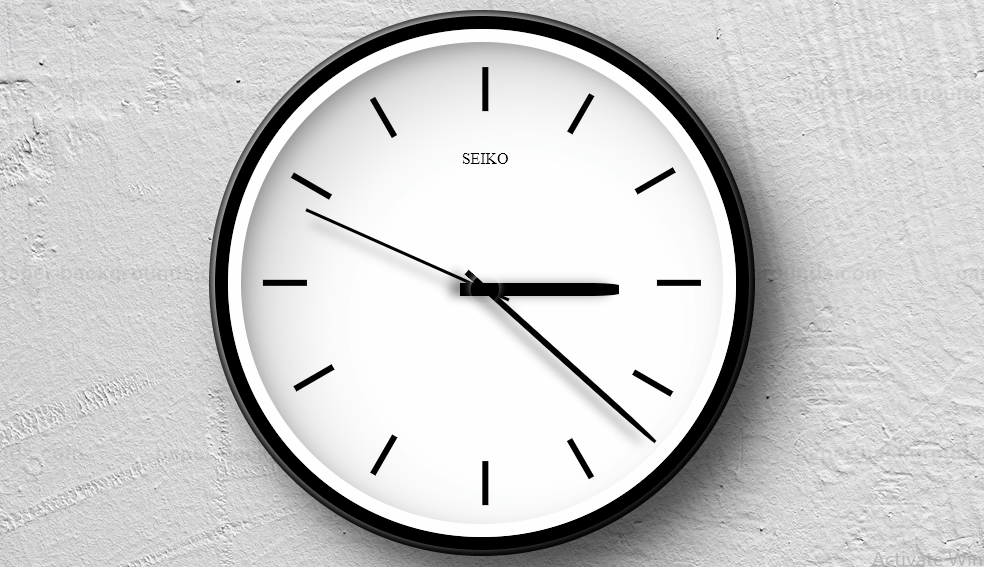

# Analog-Clock
Minimal Design Working Analog Clock Using HTML5, CSS3 and JavaScript

Just download the respository and unzip the file.  

Open index.html file and here you go.  

Enjoy the working analog clock. 

<h4>Follow me in github for more intresting project</h4>

